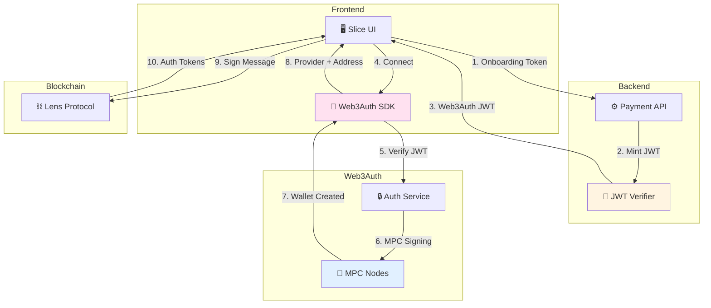
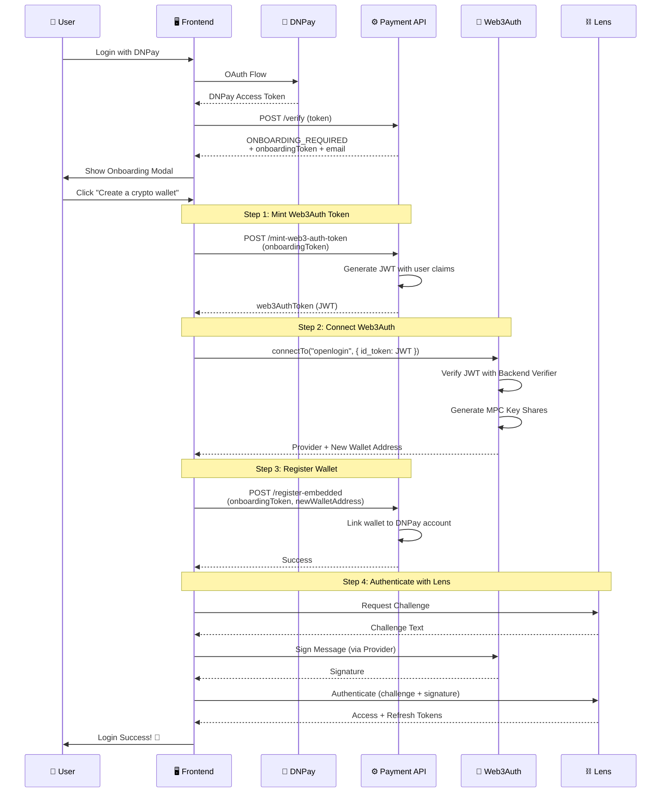
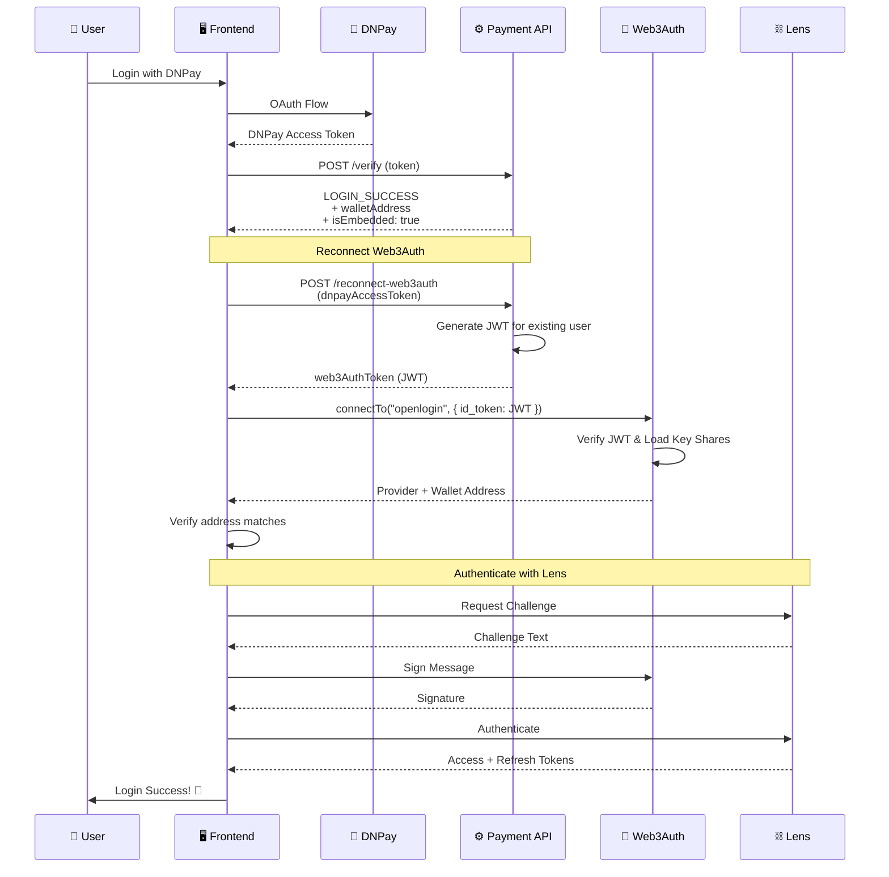

# Web3Auth Embedded Wallet Integration

## 📋 Tổng Quan

Hệ thống Slice đã được tích hợp **Web3Auth Embedded Wallet** để cung cấp trải nghiệm onboarding mượt mà cho người dùng không có ví crypto. Embedded wallet sử dụng **MPC (Multi-Party Computation)** để bảo mật private key mà không yêu cầu user tự quản lý seed phrase.

---

## 🏗️ Kiến Trúc Web3Auth

### Các Thành Phần



### Cấu Hình Web3Auth

**File**: [web3auth.ts](apps/web/src/config/web3auth.ts)

```typescript
const web3auth = new Web3Auth({
  clientId: WEB3AUTH_CLIENT_ID,
  web3AuthNetwork: WEB3AUTH_NETWORK.SAPPHIRE_DEVNET,
  privateKeyProvider: privateKeyProvider
});

const openloginAdapter = new OpenloginAdapter({
  adapterSettings: {
    uxMode: "popup",
    loginConfig: {
      jwt: {
        verifier: "slice-backend-verifier", // Custom verifier
        typeOfLogin: "jwt",
        clientId: WEB3AUTH_CLIENT_ID
      }
    }
  }
});
```

**Environment Variables**:
- `WEB3AUTH_CLIENT_ID`: Client ID từ Web3Auth Dashboard
- `WEB3AUTH_CONNECTION_NAME`: `"slice-backend-verifier"` (tên custom verifier)

---

## 🔄 Luồng Onboarding với Embedded Wallet

### Sequence Diagram



### Chi Tiết Các Bước

#### 1️⃣ **Mint Web3Auth JWT Token**

**Hook**: [useWeb3AuthOnboarding.ts](apps/web/src/hooks/useWeb3AuthOnboarding.ts)

```typescript
const web3AuthToken = await walletService.mintWeb3AuthToken(onboardingToken);
```

**API Endpoint**: `POST /dnpay/mint-web3-auth-token`

**Request**:
```json
{
  "onboardingToken": "eyJhbGc..."
}
```

**Response**:
```json
{
  "success": true,
  "data": {
    "token": "eyJhbGciOiJSUzI1NiIsInR5cCI6IkpXVCJ9..." // JWT cho Web3Auth
  }
}
```

**JWT Claims**:
```json
{
  "sub": "dnpay_user_id",        // Subject: User ID
  "email": "user@example.com",   // User email
  "name": "User Name",           // Display name
  "iat": 1703462400,             // Issued at
  "exp": 1703549000,             // Expires at (24h)
  "iss": "slice-backend",        // Issuer
  "aud": "web3auth"              // Audience
}
```

#### 2️⃣ **Connect Web3Auth với JWT**

**Service**: [auth-api.ts](apps/web/src/lib/api/auth-api.ts)

```typescript
const { provider, address } = await walletService.connectWeb3Auth(web3AuthToken);
```

**Quá Trình**:
1. Web3Auth SDK mở popup (hoặc redirect)
2. Verify JWT với backend verifier (`slice-backend-verifier`)
3. Tạo key shares sử dụng MPC (Multi-Party Computation)
4. Key shares được phân tán lưu trữ trên MPC nodes
5. Trả về Provider (viem compatible) và địa chỉ ví mới

**Lưu Ý**:
- Private key **không bao giờ** tồn tại dưới dạng complete
- Signing được thực hiện thông qua MPC threshold signing
- User không cần backup seed phrase

#### 3️⃣ **Register Embedded Wallet với Backend**

```typescript
await walletService.registerEmbeddedWallet(onboardingToken, address);
```

**API Endpoint**: `POST /dnpay/register-embedded`

**Request**:
```json
{
  "onboardingToken": "eyJhbGc...",
  "newWalletAddress": "0x742d35Cc6634C0532925a3b844Bc9e7595f0bEb"
}
```

**Response**:
```json
{
  "success": true,
  "data": {
    "userId": "dnpay_user_123",
    "walletAddress": "0x742d35Cc6634C0532925a3b844Bc9e7595f0bEb",
    "walletType": "embedded",
    "createdAt": "2025-12-23T10:30:00Z"
  }
}
```

**Database Schema** (Backend):
```typescript
{
  userId: string;              // DNPay user ID
  walletAddress: string;       // Blockchain address
  walletType: "embedded" | "external";
  web3AuthSub: string;         // Subject from JWT (để reconnect)
  createdAt: Date;
  updatedAt: Date;
}
```

#### 4️⃣ **Authenticate với Lens Protocol**

**Hook**: [useWeb3AuthLogin.tsx](apps/web/src/hooks/useWeb3AuthLogin.tsx)

```typescript
const lensTokens = await lensLogin(provider, address);
```

**Flow**:
1. Request challenge từ Lens Protocol
2. Sign challenge message sử dụng Web3Auth provider (MPC signing)
3. Submit signature để authenticate
4. Nhận Lens access/refresh tokens

```typescript
const walletClient = createWalletClient({
  chain: CHAIN,
  transport: custom(provider), // Web3Auth provider
});

const signature = await walletClient.signMessage({
  account: address as `0x${string}`,
  message: challenge.text,
});
```

---

## 🔐 Luồng Login với Embedded Wallet

### Sequence Diagram



### API Endpoint Mới Cần Implement

**Endpoint**: `POST /api/auth/dnpay/reconnect-web3auth`

**Request**:
```json
{
  "dnpayAccessToken": "bearer_token_from_dnpay"
}
```

**Response**:
```json
{
  "success": true,
  "data": {
    "web3AuthToken": "eyJhbGciOiJSUzI1NiIsInR5cCI6IkpXVCJ9...",
    "walletAddress": "0x742d35Cc6634C0532925a3b844Bc9e7595f0bEb"
  }
}
```

**Backend Logic**:
```typescript
// Pseudo code
async function reconnectWeb3Auth(dnpayAccessToken: string) {
  // 1. Verify DNPay token
  const user = await verifyDNPayToken(dnpayAccessToken);
  
  // 2. Get wallet info from database
  const wallet = await db.wallet.findOne({
    userId: user.id,
    walletType: "embedded"
  });
  
  if (!wallet) {
    throw new Error("No embedded wallet found");
  }
  
  // 3. Generate JWT với same claims như lúc tạo
  const jwt = generateJWT({
    sub: wallet.web3AuthSub, // MUST match original sub
    email: user.email,
    name: user.name,
    iss: "slice-backend",
    aud: "web3auth"
  });
  
  return {
    web3AuthToken: jwt,
    walletAddress: wallet.walletAddress
  };
}
```

**Lưu Ý Quan Trọng**:
- JWT `sub` claim phải **giống hệt** với lúc tạo wallet
- Web3Auth sử dụng `sub` để xác định key shares nào cần load
- Nếu `sub` khác → sẽ tạo wallet mới thay vì reconnect

---

## 🆚 So Sánh: External vs Embedded Wallet

| Feature | External Wallet (MetaMask) | Embedded Wallet (Web3Auth) |
|---------|---------------------------|----------------------------|
| **Setup** | User phải cài extension | Không cần cài đặt gì |
| **Private Key** | User tự quản lý | Web3Auth MPC quản lý |
| **Seed Phrase** | User phải backup | Không có seed phrase |
| **Recovery** | Dùng seed phrase | Email/social recovery |
| **UX** | Cần approve nhiều bước | Mượt mà, ít bước hơn |
| **Security** | Phụ thuộc user | MPC threshold cryptography |
| **Gas Fees** | User trả | User vẫn phải trả |
| **Onboarding** | Khó cho newbie | Dễ dàng cho newbie |

---

## 📁 Cấu Trúc Code Mới

### Hooks

**1. useWeb3AuthOnboarding.ts**
- Hook để tạo embedded wallet mới
- Xử lý toàn bộ flow từ mint token đến Lens auth
- State management cho loading

**2. useEmbeddedWalletLogin.ts**
- Hook để login với embedded wallet đã tồn tại
- Reconnect Web3Auth với JWT
- Authenticate với Lens

**3. useWeb3AuthLogin.tsx** (đã có)
- Generic hook để login Lens với bất kỳ provider nào
- Được sử dụng bởi cả external và embedded wallet flows

### Services

**auth-api.ts**
```typescript
export const walletService = {
  // Mint JWT token từ onboarding token
  mintWeb3AuthToken: async (onboardingToken: string) => {...},
  
  // Connect Web3Auth và trả về provider + address
  connectWeb3Auth: async (web3AuthToken: string) => {...},
  
  // Register embedded wallet với backend
  registerEmbeddedWallet: async (
    onboardingToken: string,
    newWalletAddress: string
  ) => {...}
};
```

### Components

**DNPayOnboardingModal.tsx** (updated)
```tsx
<DNPayOnboardingModal
  open={showOnboardingModal}
  onClose={() => setShowOnboardingModal(false)}
  onHasWallet={handleConnectMetaMask}
  onCreateWallet={handleCreateEmbeddedWallet}  // ✨ NEW
  isCreatingWallet={isCreatingWallet}          // ✨ NEW
/>
```

**DNPayLoginButton.tsx** (updated)
```typescript
// Import hook
import { useWeb3AuthOnboarding } from "@/hooks/useWeb3AuthOnboarding";

// Usage
const { createEmbeddedWallet, isLoading: isCreatingWallet } = useWeb3AuthOnboarding();

const handleCreateEmbeddedWallet = async () => {
  const result = await createEmbeddedWallet(onboardingData.onboardingToken);
  if (result.success && result.lensTokens) {
    signIn(result.lensTokens);
    window.location.href = "/";
  }
};
```

---

## 🔒 Security Considerations

### 1. **JWT Security**

**Token Signing**:
- Backend phải sign JWT với RS256 (RSA asymmetric)
- Public key được upload lên Web3Auth Dashboard
- Private key phải được bảo mật tuyệt đối

**Token Expiration**:
```typescript
{
  iat: Math.floor(Date.now() / 1000),      // Now
  exp: Math.floor(Date.now() / 1000) + 86400 // 24 hours
}
```

**Claims Validation**:
- `sub`: Phải unique và persistent cho mỗi user
- `iss`: Must match configured issuer trong Web3Auth
- `aud`: Must be "web3auth"

### 2. **MPC Security**

**Threshold Signing**:
- Web3Auth sử dụng 2-of-3 threshold scheme
- 3 key shares: User device, Web3Auth node 1, Web3Auth node 2
- Cần ít nhất 2 shares để ký transaction
- Không node nào có complete private key

**Recovery**:
- User có thể recover wallet qua email/social
- Recovery flow cũng sử dụng JWT authentication
- New device → same JWT sub → same key shares

### 3. **Backend Security**

**Onboarding Token Validation**:
```typescript
// Backend must validate onboarding token before minting JWT
function validateOnboardingToken(token: string): UserInfo {
  // 1. Verify token signature
  // 2. Check expiration
  // 3. Ensure single-use (mark as used in database)
  // 4. Return user info
}
```

**Rate Limiting**:
```typescript
// Prevent abuse
rateLimit({
  windowMs: 15 * 60 * 1000, // 15 minutes
  max: 5, // Max 5 wallet creations per window
  message: "Too many wallets created, try again later"
})
```

---

## 🧪 Testing Guide

### Unit Tests

**Test useWeb3AuthOnboarding**:
```typescript
describe('useWeb3AuthOnboarding', () => {
  it('should create embedded wallet successfully', async () => {
    const { result } = renderHook(() => useWeb3AuthOnboarding());
    
    const onboardingToken = 'mock_token';
    const outcome = await result.current.createEmbeddedWallet(onboardingToken);
    
    expect(outcome.success).toBe(true);
    expect(outcome.walletAddress).toMatch(/^0x[a-fA-F0-9]{40}$/);
    expect(outcome.lensTokens).toBeDefined();
  });
});
```

### Integration Tests

**Test Full Onboarding Flow**:
1. Mock DNPay OAuth response với ONBOARDING_REQUIRED
2. Mock `mintWeb3AuthToken` API
3. Mock Web3Auth `connectTo` method
4. Mock `registerEmbeddedWallet` API
5. Mock Lens challenge/authenticate
6. Verify final state có tokens được lưu

### Manual Testing Checklist

- [ ] User click "Create a crypto wallet" → Web3Auth popup xuất hiện
- [ ] Popup verify JWT thành công → wallet address được tạo
- [ ] Wallet được register với backend
- [ ] Lens authentication thành công
- [ ] User được redirect về home page
- [ ] Logout và login lại → reconnect embedded wallet thành công
- [ ] Wallet address giữ nguyên sau reconnect

---

## 🚨 Error Handling

### Common Errors

| Error | Cause | Solution |
|-------|-------|----------|
| `Invalid JWT` | JWT format sai hoặc signature invalid | Check backend signing logic |
| `JWT expired` | Token đã hết hạn | Regenerate token với fresh expiry |
| `Verifier not found` | Custom verifier chưa setup | Configure verifier in Web3Auth Dashboard |
| `MPC signing failed` | Network issue hoặc key shares không đủ | Retry hoặc check Web3Auth status |
| `Address mismatch` | JWT sub khác với lúc tạo | Ensure consistent sub claim |
| `Popup blocked` | Browser block popup | Ask user to allow popups |

### Error Toast Examples

```typescript
// JWT minting failed
toast.error("Failed to create authentication token. Please try again.");

// Web3Auth connection failed
toast.error("Failed to create wallet. Please check your connection.");

// Registration failed
toast.error("Failed to register wallet. Please contact support.");

// Lens authentication failed
toast.error("Failed to authenticate with Lens Protocol.");
```

---

## 🔮 Future Improvements

### 1. **Social Recovery**
```typescript
// User có thể recover wallet qua Google/Twitter/etc
const { provider, address } = await walletService.connectWeb3Auth(jwt, {
  loginProvider: "google",
  extraLoginOptions: {
    login_hint: "user@gmail.com"
  }
});
```

### 2. **Gasless Transactions**
- Integrate với Lens relayer
- Sponsor gas fees cho user mới
- Meta-transactions cho better UX

### 3. **Multi-Chain Support**
- Hiện tại chỉ support Polygon
- Có thể mở rộng sang BSC, Arbitrum, etc
- Web3Auth hỗ trợ multi-chain sẵn

### 4. **Hardware Wallet Support**
- Cho advanced users muốn security cao hơn
- Kết hợp embedded wallet với hardware backup

### 5. **Session Management**
- Auto-refresh Web3Auth session
- Persistent login (giống MetaMask)
- Biometric auth cho mobile

---

## 📚 Related Files

### New Files
- [useWeb3AuthOnboarding.ts](apps/web/src/hooks/useWeb3AuthOnboarding.ts) - Hook tạo embedded wallet
- [useEmbeddedWalletLogin.ts](apps/web/src/hooks/useEmbeddedWalletLogin.ts) - Hook login embedded wallet
- [WEB3AUTH_EMBEDDED_WALLET_FLOW.md](WEB3AUTH_EMBEDDED_WALLET_FLOW.md) - Documentation

### Updated Files
- [DNPayOnboardingModal.tsx](apps/web/src/components/Shared/Auth/DNPayOnboardingModal.tsx) - Add onCreateWallet
- [DNPayLoginButton.tsx](apps/web/src/components/Shared/Auth/DNPayLoginButton.tsx) - Integrate embedded wallet
- [auth-api.ts](apps/web/src/lib/api/auth-api.ts) - Export API_BASE_URL

### Existing Files
- [web3auth.ts](apps/web/src/config/web3auth.ts) - Web3Auth configuration
- [useWeb3AuthLogin.tsx](apps/web/src/hooks/useWeb3AuthLogin.tsx) - Lens login hook
- [constants.ts](packages/data/constants.ts) - Web3Auth constants

---

## 📊 Flow Comparison

### Before (External Wallet Only)

```
DNPay Login → ONBOARDING_REQUIRED → Modal
                                       ↓
                              [Has Wallet] → Connect MetaMask → Link → Verify → Lens Auth
```

### After (With Embedded Wallet)

```
DNPay Login → ONBOARDING_REQUIRED → Modal
                                       ↓
                       [Has Wallet] → Connect MetaMask → Link → Verify → Lens Auth
                                       ↓
                      [Create Wallet] → Mint JWT → Web3Auth → Register → Lens Auth
                                                                              ↓
                                                                        LOGIN SUCCESS
```

---

## 🎓 Key Takeaways

### ✅ Ưu Điểm Của Embedded Wallet

1. **Onboarding Mượt Mà**: Không cần cài extension, không cần seed phrase
2. **Web2-like UX**: Gần giống đăng nhập email/social truyền thống
3. **MPC Security**: Private key không bao giờ tồn tại hoàn chỉnh
4. **Cross-Device**: Login từ bất kỳ device nào với cùng account
5. **Recovery Dễ Dàng**: Qua email hoặc social, không sợ mất seed phrase

### ⚠️ Điểm Cần Lưu Ý

1. **Trust Model**: User phải tin tưởng Web3Auth nodes
2. **JWT Sub Consistency**: Backend phải ensure consistent sub claim
3. **Single Point of Failure**: Web3Auth downtime → không access được wallet
4. **Gas Fees**: User vẫn phải trả gas (khác với custodial wallet hoàn toàn)
5. **Regulatory**: Có thể cần comply với regulations về custodial services

---

**Document Version**: 1.0  
**Last Updated**: December 23, 2025  
**Integration Status**: ✅ Frontend Complete, ⏳ Backend Pending  
**Author**: GitHub Copilot  
**Contact**: [Support](mailto:support@slice.social)
