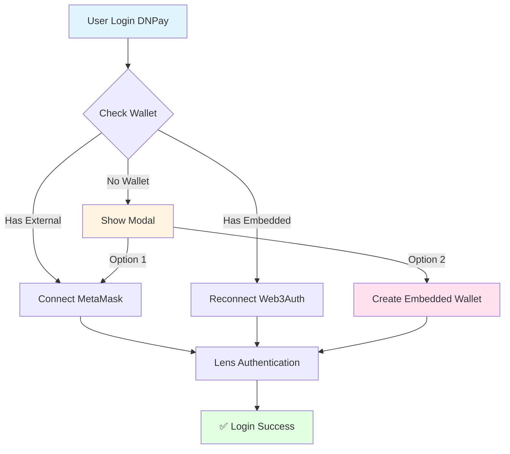

# Web3Auth Integration - Quick Start Guide

## 🎯 Tóm Tắt

Đã tích hợp thành công **Web3Auth Embedded Wallet** vào hệ thống Slice, cho phép user tạo ví crypto mới không cần MetaMask hoặc seed phrase.

---

## ✅ Những Gì Đã Hoàn Thành

### Frontend Implementation

#### 1. **Hooks Mới**
- ✅ [useWeb3AuthOnboarding.ts](apps/web/src/hooks/useWeb3AuthOnboarding.ts)
  - Xử lý tạo embedded wallet mới
  - Flow: mint JWT → connect Web3Auth → register → Lens auth
  
- ✅ [useEmbeddedWalletLogin.ts](apps/web/src/hooks/useEmbeddedWalletLogin.ts)
  - Xử lý login với embedded wallet đã tồn tại
  - Flow: reconnect Web3Auth → Lens auth

#### 2. **Components Updated**
- ✅ [DNPayOnboardingModal.tsx](apps/web/src/components/Shared/Auth/DNPayOnboardingModal.tsx)
  - Thêm `onCreateWallet` prop
  - Thêm loading state `isCreatingWallet`
  - UI cho "Create a crypto wallet" button

- ✅ [DNPayLoginButton.tsx](apps/web/src/components/Shared/Auth/DNPayLoginButton.tsx)
  - Import `useWeb3AuthOnboarding`
  - Thêm `handleCreateEmbeddedWallet` function
  - Pass props cho modal

#### 3. **Services Updated**
- ✅ [auth-api.ts](apps/web/src/lib/api/auth-api.ts)
  - Export `API_BASE_URL` để sử dụng ở hooks
  - Các functions đã có sẵn:
    - `mintWeb3AuthToken()`
    - `connectWeb3Auth()`
    - `registerEmbeddedWallet()`

---

## ⏳ Backend Cần Implement

### Required Endpoints

#### 1. **Mint Web3Auth Token**
```
POST /api/auth/dnpay/mint-web3-auth-token
```

**Request**:
```json
{
  "onboardingToken": "eyJhbGc..."
}
```

**Response**:
```json
{
  "success": true,
  "data": {
    "token": "eyJhbGciOiJSUzI1NiIsInR5cCI6IkpXVCJ9..."
  }
}
```

**JWT Payload**:
```json
{
  "sub": "dnpay_user_id",
  "email": "user@example.com",
  "name": "User Name",
  "iat": 1703462400,
  "exp": 1703549000,
  "iss": "slice-backend",
  "aud": "web3auth"
}
```

#### 2. **Register Embedded Wallet**
```
POST /api/auth/dnpay/register-embedded
```

**Request**:
```json
{
  "onboardingToken": "eyJhbGc...",
  "newWalletAddress": "0x742d35Cc6634C0532925a3b844Bc9e7595f0bEb"
}
```

**Response**:
```json
{
  "success": true,
  "data": {
    "userId": "dnpay_user_123",
    "walletAddress": "0x742d35Cc6634C0532925a3b844Bc9e7595f0bEb",
    "walletType": "embedded",
    "createdAt": "2025-12-23T10:30:00Z"
  }
}
```

#### 3. **Reconnect Web3Auth** (cho login flow)
```
POST /api/auth/dnpay/reconnect-web3auth
```

**Request**:
```json
{
  "dnpayAccessToken": "bearer_token_from_dnpay"
}
```

**Response**:
```json
{
  "success": true,
  "data": {
    "web3AuthToken": "eyJhbGciOiJSUzI1NiIsInR5cCI6IkpXVCJ9...",
    "walletAddress": "0x742d35Cc6634C0532925a3b844Bc9e7595f0bEb"
  }
}
```

#### 4. **Update Verify Endpoint**

Existing endpoint cần trả thêm field:

```
POST /api/auth/dnpay/verify
```

**Response** (when wallet exists):
```json
{
  "success": true,
  "data": {
    "status": "LOGIN_SUCCESS",
    "user": {
      "id": "0x742d35Cc6634C0532925a3b844Bc9e7595f0bEb",
      "email": "user@example.com",
      "walletAddress": "0x742d35Cc6634C0532925a3b844Bc9e7595f0bEb",
      "isEmbeddedWallet": true  // ⚠️ THÊM FIELD NÀY
    }
  }
}
```

---

## 🗄️ Database Schema

### Wallet Table

```typescript
interface Wallet {
  id: string;
  userId: string;              // DNPay user ID
  walletAddress: string;       // 0x...
  walletType: "embedded" | "external";
  web3AuthSub: string;         // JWT sub claim (để reconnect)
  createdAt: Date;
  updatedAt: Date;
}

// Indexes
index_userId: { userId: 1 }
index_walletAddress: { walletAddress: 1 }
unique_userId_walletType: { userId: 1, walletType: 1 }
```

---

## 🔐 Web3Auth Setup Required

### 1. **Create Web3Auth Account**
- Go to https://dashboard.web3auth.io
- Create project
- Note down `clientId`

### 2. **Configure Custom JWT Verifier**

**Verifier Settings**:
- Name: `slice-backend-verifier`
- Verifier Type: `Custom JWT`
- JWT Validation:
  - Issuer: `slice-backend`
  - Audience: `web3auth`
- Upload RS256 Public Key

**Generate RSA Key Pair** (backend):
```bash
# Generate private key
openssl genrsa -out jwt-private.pem 2048

# Extract public key
openssl rsa -in jwt-private.pem -pubout -out jwt-public.pem
```

### 3. **Environment Variables**

**Frontend** (.env):
```env
WEB3AUTH_CLIENT_ID=your_client_id_here
```

**Backend** (.env):
```env
JWT_PRIVATE_KEY=path/to/jwt-private.pem
JWT_PUBLIC_KEY=path/to/jwt-public.pem
WEB3AUTH_CLIENT_ID=your_client_id_here
```

---

## 🧪 Testing Steps

### 1. **Test Onboarding Flow**

```bash
# Bước 1: User click "Continue with DNPAY"
# Bước 2: DNPay OAuth → ONBOARDING_REQUIRED
# Bước 3: Modal hiện lên với 2 options
# Bước 4: Click "Create a crypto wallet"
# Bước 5: Web3Auth popup → tạo wallet
# Bước 6: Wallet được register
# Bước 7: Lens authentication
# Bước 8: Redirect về home
```

**Expected Console Logs**:
```
🔐 DNPAY Login success, authenticating with Lens Protocol...
Creating your embedded wallet...
Wallet created: 0x742d...0bEb
Registering your wallet...
Wallet registered successfully!
Authenticating with Lens Protocol...
Đăng nhập Lens thành công!
```

### 2. **Test Login Flow**

```bash
# Bước 1: User đã có embedded wallet
# Bước 2: Login DNPay → LOGIN_SUCCESS với isEmbeddedWallet: true
# Bước 3: Reconnect Web3Auth
# Bước 4: Lens authentication
# Bước 5: Login success
```

### 3. **Error Cases**

Test các trường hợp:
- ❌ JWT expired → regenerate token
- ❌ Web3Auth popup blocked → show message
- ❌ Network error → show retry
- ❌ Lens authentication failed → clear error message

---

## 📊 User Flow Diagram



---

## 🚀 Deployment Checklist

### Frontend

- [ ] Environment variables set (`WEB3AUTH_CLIENT_ID`)
- [ ] Web3Auth SDK initialized properly
- [ ] All imports working
- [ ] TypeScript compiled without errors
- [ ] Test on staging environment

### Backend

- [ ] RSA key pair generated
- [ ] Public key uploaded to Web3Auth Dashboard
- [ ] JWT signing implemented with RS256
- [ ] All 4 endpoints implemented
- [ ] Database schema created
- [ ] Environment variables set
- [ ] Test all endpoints with Postman/Insomnia

### Web3Auth Dashboard

- [ ] Project created
- [ ] Custom verifier configured
- [ ] Public key uploaded
- [ ] Verifier name matches (`slice-backend-verifier`)
- [ ] Whitelist domains (staging + production)

---

## 📚 Documentation

Chi tiết đầy đủ xem tại:
- [WEB3AUTH_EMBEDDED_WALLET_FLOW.md](WEB3AUTH_EMBEDDED_WALLET_FLOW.md)

---

## 🆘 Support

### Common Issues

**Q: Web3Auth popup không hiện?**  
A: Check browser console for errors. Ensure `WEB3AUTH_CLIENT_ID` correct.

**Q: JWT verification failed?**  
A: Ensure public key uploaded to Web3Auth matches private key trên backend.

**Q: Wallet address khác sau reconnect?**  
A: JWT `sub` claim phải giống hệt lúc tạo wallet.

**Q: MPC signing failed?**  
A: Check Web3Auth service status: https://status.web3auth.io

---

**Implementation Status**: ✅ Frontend Complete | ⏳ Backend In Progress  
**Last Updated**: December 23, 2025  
**Next Steps**: Backend implementation + testing
