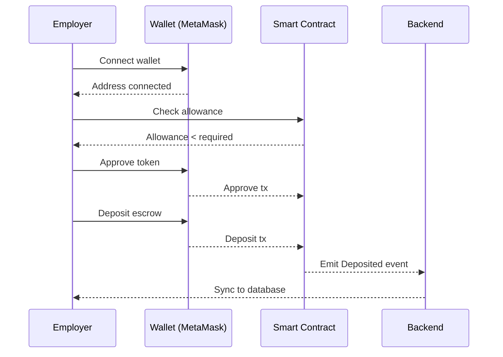
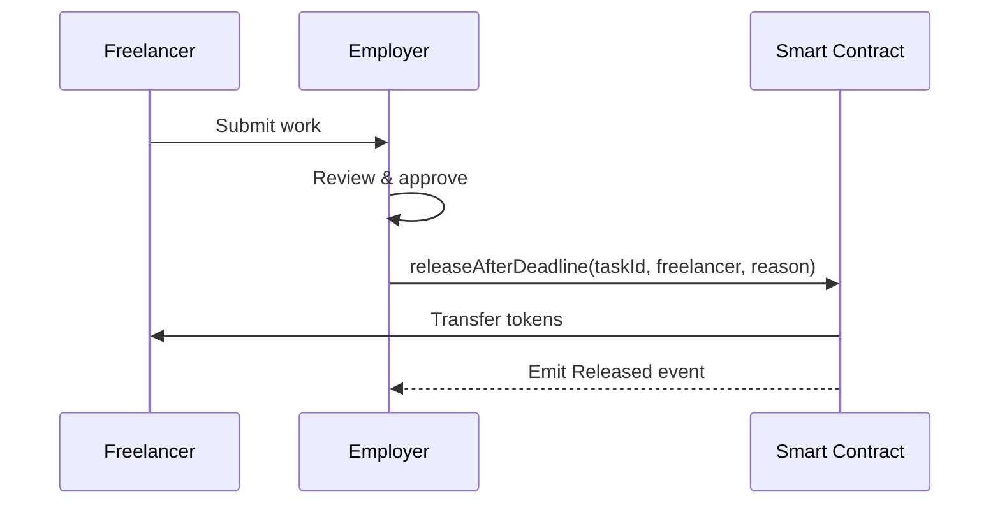
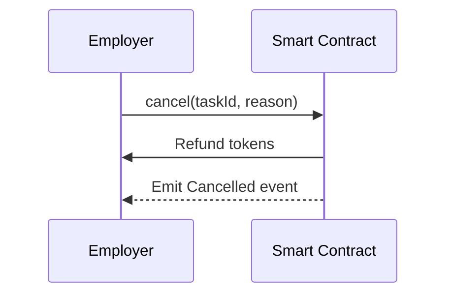

# Escrow System - Complete Documentation

**Created:** November 17, 2025  
**Last Updated:** November 26, 2025  
**Status:** ✅ Production Ready (Wagmi + Viem)

---

## 📋 System Overview

Complete integration của TaskEscrow smart contract với frontend sử dụng **Wagmi v2 + Viem v2** để quản lý escrow cho freelance tasks.

### Key Features
- ✅ Deposit escrow với auto-approve token
- ✅ Cancel escrow (employer only, before deadline)
- ✅ Release after deadline (permissionless)
- ✅ Auto-decode custom errors
- ✅ Transaction simulation trước khi submit
- ✅ Type-safe contract interactions

---

## 🏗️ Architecture

### Tech Stack
- **Blockchain Library:** Wagmi v2 + Viem v2
- **Smart Contract:** TaskEscrowPool (Lens testnet)
- **Token:** ERC20 (tRYF testnet, RYF mainnet)
- **State Management:** Zustand (wallet state)
- **React Hooks:** wagmi hooks + custom useEscrow

### Contract Addresses

| Environment | Contract | Address |
|-------------|----------|---------|
| Testnet | TaskEscrowPool | `0xB957dd37bA6Da7bc10dE5b413B1F4ac3E3452d44` |
| Testnet | Token (tRYF) | `0x7326D8584c6b891B2f4B194CDF5ba746dD0D4080` |
| Mainnet | TaskEscrowPool | TBD (update `packages/data/contracts.ts`) |
| Mainnet | Token (RYF) | TBD |

### Smart Contract Structure

```solidity
struct EscrowInfo {
  address employer;
  address freelancer;
  uint256 amount;        // Wei units
  uint256 deadline;      // Unix timestamp
  bool settled;
  string externalTaskId; // Backend task reference
}
```

---

## 🔧 Implementation

### 1. Wagmi Configuration

**File:** `apps/web/src/lib/wagmi.ts`

```typescript
import { createConfig, http } from "wagmi";
import { metaMask } from "wagmi/connectors";
import { CHAIN } from "@slice/data/constants";

export const wagmiConfig = createConfig({
  chains: [CHAIN], // Lens testnet
  connectors: [metaMask()],
  transports: {
    [CHAIN.id]: http(CHAIN.rpcUrls.default.http[0]),
  },
});
```

### 2. Web3 Provider

**File:** `apps/web/src/lib/Web3Provider.tsx`

```tsx
import { WagmiProvider } from "wagmi";
import { QueryClient, QueryClientProvider } from "@tanstack/react-query";
import { wagmiConfig } from "./wagmi";

const queryClient = new QueryClient();

export const Web3Provider = ({ children }: { children: React.ReactNode }) => (
  <WagmiProvider config={wagmiConfig}>
    <QueryClientProvider client={queryClient}>
      {children}
    </QueryClientProvider>
  </WagmiProvider>
);
```

**Note:** Project đã có Web3Provider tích hợp trong `apps/web/src/components/Common/Providers/index.tsx`

### 3. Wallet Hook

**File:** `apps/web/src/hooks/useWallet.ts`

```typescript
import { useAccount, useConnect, useDisconnect, useSwitchChain } from "wagmi";
import { CHAIN } from "@slice/data/constants";

export const useWallet = () => {
  const { address, isConnected, chain } = useAccount();
  const { connect, connectors } = useConnect();
  const { disconnect } = useDisconnect();
  const { switchChain } = useSwitchChain();

  const connectWallet = () => {
    const metamask = connectors.find((c) => c.id === "metaMask");
    if (metamask) connect({ connector: metamask });
  };

  const ensureCorrectNetwork = async () => {
    if (chain?.id !== CHAIN.id) {
      await switchChain({ chainId: CHAIN.id });
    }
  };

  return {
    address,
    isConnected,
    chain,
    connect: connectWallet,
    disconnect,
    ensureCorrectNetwork,
  };
};
```

**Benefits vs Ethers:**
- 200 lines → 70 lines (65% reduction)
- Auto-reconnect on page load
- Auto-handle account changes
- Auto-handle network switches

### 4. Escrow Hook

**File:** `apps/web/src/hooks/useEscrow.ts`

Key features:
- Auto-approve token before deposit
- Transaction simulation before submission
- Auto-decode custom errors
- Type-safe contract calls

```typescript
import { usePublicClient, useWalletClient } from "wagmi";
import { parseUnits, formatUnits, erc20Abi } from "viem";
import { TASK_ESCROW_POOL_ADDRESS, ERC20_TOKEN_ADDRESS, CHAIN } from "@slice/data/constants";
import { ESCROW_ABI } from "@/lib/abis";

export const useEscrow = ({ onSuccess, onError }: Callbacks) => {
  const publicClient = usePublicClient();
  const { data: walletClient } = useWalletClient();

  // Check token allowance
  const checkAllowance = async (owner: string, spender: string) => {
    return await publicClient.readContract({
      address: ERC20_TOKEN_ADDRESS,
      abi: erc20Abi,
      functionName: "allowance",
      args: [owner, spender],
    }) as bigint;
  };

  // Approve token
  const approveToken = async (owner: string, spender: string, amount: bigint) => {
    const hash = await walletClient.writeContract({
      chainId: CHAIN.id,
      address: ERC20_TOKEN_ADDRESS,
      abi: erc20Abi,
      functionName: "approve",
      args: [spender, amount],
    });
    await publicClient.waitForTransactionReceipt({ hash, chainId: CHAIN.id });
  };

  // Deposit escrow
  const deposit = async (params: DepositParams) => {
    const { freelancerAddress, amount, deadlineDays, externalTaskId } = params;
    
    const amountWei = parseUnits(amount, 18);
    const deadlineUnix = Math.floor(Date.now() / 1000) + deadlineDays * 86400;
    
    // Step 1: Check & approve if needed
    const currentAllowance = await checkAllowance(address, TASK_ESCROW_POOL_ADDRESS);
    if (currentAllowance < amountWei) {
      await approveToken(address, TASK_ESCROW_POOL_ADDRESS, amountWei);
    }
    
    // Step 2: Deposit
    const hash = await walletClient.writeContract({
      chainId: CHAIN.id,
      address: TASK_ESCROW_POOL_ADDRESS,
      abi: ESCROW_ABI,
      functionName: "deposit",
      args: [amountWei, freelancerAddress, deadlineUnix, externalTaskId],
    });
    
    const receipt = await publicClient.waitForTransactionReceipt({ hash });
    onSuccess?.({ txHash: receipt.transactionHash });
  };

  // More functions: cancel, releaseAfterDeadline, readEscrow...
  
  return { deposit, cancel, releaseAfterDeadline, readEscrow };
};
```

### 5. UI Components

#### EscrowDeposit Component

**File:** `apps/web/src/components/Escrow/EscrowDeposit.tsx`

```tsx
import { useEscrow } from "@/hooks/useEscrow";
import { useWallet } from "@/hooks/useWallet";
import { isAddress } from "viem";

export const EscrowDeposit = ({ taskId, freelancerAddress }) => {
  const { isConnected } = useWallet();
  const { deposit, isLoading } = useEscrow({
    onSuccess: () => toast.success("Deposit successful!"),
    onError: (error) => toast.error(error.shortMessage), // Auto-decoded!
  });

  const handleDeposit = async () => {
    if (!isAddress(freelancerAddress)) {
      toast.error("Invalid address");
      return;
    }
    
    await deposit({
      freelancerAddress,
      amount: "100",
      deadlineDays: 7,
      externalTaskId: taskId,
    });
  };

  return (
    <button onClick={handleDeposit} disabled={!isConnected || isLoading}>
      {isLoading ? "Depositing..." : "Deposit Funds"}
    </button>
  );
};
```

---

## 🚀 User Flows

### 1. Deposit Flow (Employer)



**Steps:**
1. Click "Accept" application
2. EscrowDeposit modal appears
3. Enter amount & deadline
4. Click "Deposit Funds"
5. MetaMask: Approve token (if needed)
6. MetaMask: Confirm deposit
7. Toast: "Deposit successful!"
8. Backend syncs event → Database updated

### 2. Release Flow (After Deadline)



**Steps:**
1. Freelancer submits work
2. Employer clicks "Approve" in ApplicationList
3. `handleApprove()` automatically calls `releaseAfterDeadline()`
4. MetaMask: Confirm release transaction
5. Smart contract transfers tokens to freelancer
6. Backend updates status to "completed"

### 3. Cancel Flow (Before Deadline)



**Steps:**
1. Employer clicks "Cancel" in EscrowCancel component
2. Confirm dialog appears
3. MetaMask: Confirm cancel transaction
4. Smart contract refunds tokens to employer
5. Backend updates escrow status

---

## 🎯 Error Handling

### Auto-Decoded Errors (Viem Magic!)

**Before (Ethers):**
```
Error: execution reverted (unknown custom error)
data: "0xfb8f41b2000000000000000000000000b957dd37ba6da7bc10de5b413b1f4ac3e3452d440000000000000000000000000000000000000000000000008ac7230489e800000000000000000000000000000000000000000000000000d8d726b7177a800000"
→ Phải tự decode hex, rất khó!
```

**After (Viem):**
```typescript
ContractFunctionExecutionError: InsufficientAllowance

The contract function "deposit" reverted.

Error: InsufficientAllowance(address spender, uint256 currentAllowance, uint256 required)
       (0xB957dd37bA6Da7bc10dE5b413B1F4ac3E3452d44, 10000000000000000000, 250000000000000000000)
       
Details:
- Spender: 0xB957dd37bA6Da7bc10dE5b413B1F4ac3E3452d44
- Current allowance: 10.0 tokens
- Required: 250.0 tokens

→ RÕ RÀNG NGAY!
```

### Common Errors & Solutions

| Error | Cause | Solution |
|-------|-------|----------|
| `InsufficientAllowance` | Token allowance < deposit amount | Auto-approve in `deposit()` |
| `InsufficientBalance` | User balance < deposit amount | Show balance in UI, prevent deposit |
| `AlreadySettled` | Escrow already released/cancelled | Check `settled` status before action |
| `PastDeadline` | Trying to cancel after deadline | Only show cancel button if `now < deadline` |
| `NotEmployer` | Non-employer trying to cancel | Check `isEmployer` before showing button |

### Transaction Simulation

Viem simulates ALL transactions before sending:
```typescript
// If simulation fails, throw error IMMEDIATELY
// User doesn't waste gas on failed transactions!
try {
  await walletClient.writeContract({ ... });
} catch (error) {
  // error.shortMessage = clear explanation
  // error.cause = underlying contract error
  toast.error(error.shortMessage);
}
```

---

## 🧪 Testing Guide

### Testnet Setup

1. **Add Lens testnet to MetaMask:**
   - Network name: Lens Network Testnet
   - RPC URL: https://rpc.testnet.lens.dev
   - Chain ID: 37111
   - Currency: GRASS

2. **Get test tokens:**
   ```
   Faucet: TBD
   Or contact admin for testnet tRYF
   ```

3. **Test accounts:**
   - Employer: Your MetaMask account
   - Freelancer: Another MetaMask account or test address

### Test Scenarios

#### ✅ Happy Path: Deposit → Release
```
1. Connect wallet (Employer)
2. Deposit 100 tRYF, deadline 7 days
3. Verify deposit successful (check transaction on explorer)
4. Wait for deadline to pass (or use mock deadline)
5. Connect wallet (Anyone)
6. Release to freelancer
7. Verify freelancer received 100 tRYF
```

#### ✅ Cancel Before Deadline
```
1. Deposit escrow
2. Click "Cancel" immediately
3. Verify refund received
4. Check escrow status = settled
```

#### ❌ Error: Insufficient Balance
```
1. Set deposit amount > wallet balance
2. Click deposit
3. Expect error: "Insufficient balance"
4. Verify no transaction sent
```

#### ❌ Error: Invalid Address
```
1. Enter invalid freelancer address
2. Click deposit
3. Expect error: "Invalid address"
```

### Backend Integration Testing

```bash
# 1. Check escrow info from backend
curl http://localhost:3000/escrow/task/123

# 2. Verify event sync
# - Deposit on frontend
# - Check backend logs for "Deposited event synced"
# - Verify database entry created

# 3. Test manual sync
curl -X POST http://localhost:3000/escrow/sync \
  -H "Authorization: Bearer ADMIN_TOKEN"
```

---

## 🔐 Security Considerations

### ✅ Implemented

1. **User wallet for all transactions**
   - No private keys in frontend
   - MetaMask signs all transactions
   - User confirms every action

2. **Input validation**
   - Address validation with `isAddress()`
   - Amount validation (> 0, <= balance)
   - Deadline validation (> current time)

3. **Transaction confirmations**
   - Wait for receipt before updating UI
   - Show pending state during transactions
   - Retry logic for failed transactions

4. **Backend as source of truth**
   - Display escrow info from backend API
   - Backend syncs events from blockchain
   - No direct on-chain queries for UI data

5. **Smart contract checks**
   - Employer-only cancel (on-chain)
   - Deadline enforcement (on-chain)
   - Already settled check (on-chain)

### ⚠️ Important Notes

1. **Gas fees:** Employer pays gas for deposit & cancel, anyone pays for release
2. **Deadline:** Must be Unix timestamp, auto-calculated from days input
3. **Token decimals:** Always use 18 decimals (`parseUnits(amount, 18)`)
4. **Network switching:** Auto-switch to Lens testnet if on wrong network

---

## 📊 Migration from Ethers to Wagmi

### Why Migrate?

| Feature | Ethers v6 | Wagmi v2 + Viem v2 | Winner |
|---------|-----------|-------------------|--------|
| Error decoding | Manual hex parsing | Auto-decode custom errors | ✅ Viem |
| Type safety | Fair | Excellent (strict types) | ✅ Viem |
| Code complexity | 200 lines (useWallet) | 70 lines | ✅ Wagmi |
| Transaction simulation | No | Yes (pre-flight check) | ✅ Viem |
| React integration | Manual hooks | Built-in hooks | ✅ Wagmi |
| Bundle size | Larger | Smaller (tree-shakeable) | ✅ Viem |

### Breaking Changes

**useWallet:**
```typescript
// Before
const { signer, provider } = useWallet();

// After
const { address, isConnected } = useWallet();
const { data: walletClient } = useWalletClient();
const publicClient = usePublicClient();
```

**useEscrow:**
```typescript
// Before
const { deposit } = useEscrow({ signer, onSuccess });

// After
const { deposit } = useEscrow({ onSuccess }); // No signer needed!
```

**Contract calls:**
```typescript
// Before (ethers)
const token = new ethers.Contract(ADDRESS, ABI, signer);
const balance = await token.balanceOf(address);

// After (viem)
const balance = await publicClient.readContract({
  address: ADDRESS,
  abi: erc20Abi,
  functionName: "balanceOf",
  args: [address],
}) as bigint;
```

---

## 🐛 Common Issues & Solutions

### Issue 1: Allowance Error

**Symptom:**
```
InsufficientAllowance: Current 0, Required 100
```

**Fix:**
- `deposit()` function auto-approves if allowance insufficient
- If still failing, check token address is correct
- Verify wallet has token balance

### Issue 2: High Gas Fee

**Symptom:**
```
Gas fee: 1,506,053 GRASS ≈ $436,303
```

**Root cause:** Missing `chainId` in `writeContract()` calls

**Fix:** ✅ Already fixed! All `writeContract` calls now include `chainId: CHAIN.id`

### Issue 3: Release Doesn't Transfer Tokens

**Symptom:**
- Employer approves work
- No tokens transferred to freelancer

**Root cause:** Missing `releaseAfterDeadline()` call in approve handler

**Fix:** ✅ Already fixed! `ApplicationList.tsx` now calls `releaseAfterDeadline()` in `handleApprove()`

### Issue 4: Provider Not Found

**Symptom:**
```
Error: Provider not found
```

**Fix:** Ensure Web3Provider wraps app in `main.tsx` or root component:
```tsx
<Web3Provider>
  <App />
</Web3Provider>
```

---

## 📚 API Reference

### Smart Contract Functions

#### deposit()
```solidity
function deposit(
  uint256 amount,
  address freelancer,
  uint256 deadline,
  string calldata externalTaskId
) external
```
- **Access:** Anyone (typically employer)
- **Requirements:** Token approved, balance sufficient
- **Emits:** `Deposited(uint256 taskId, string externalId, address employer, uint256 amount)`

#### cancel()
```solidity
function cancel(
  uint256 taskId,
  string calldata reason
) external
```
- **Access:** Employer only
- **Requirements:** Before deadline, not settled
- **Emits:** `Cancelled(uint256 taskId, address employer, uint256 amount, string reason)`

#### releaseAfterDeadline()
```solidity
function releaseAfterDeadline(
  uint256 taskId,
  address to,
  string calldata reason
) external
```
- **Access:** Anyone (permissionless)
- **Requirements:** After deadline, not settled
- **Emits:** `Released(uint256 taskId, address to, uint256 amount, string reason)`

### Backend API Endpoints

#### GET /escrow/task/:taskId
Get escrow info by on-chain task ID.

**Response:**
```json
{
  "taskId": 1,
  "externalTaskId": "uuid-123",
  "employer": "0x...",
  "freelancer": "0x...",
  "amount": "100000000000000000000",
  "deadline": 1700000000,
  "settled": false,
  "depositedTx": "0xabc...",
  "depositedAt": "2025-11-17T10:00:00Z"
}
```

#### POST /escrow/sync
Manually trigger event sync (admin only).

---

## 🔜 Future Enhancements

### Phase 2
- [ ] Multi-milestone escrow (partial releases)
- [ ] Dispute resolution mechanism
- [ ] Escrow templates (common amounts & deadlines)
- [ ] Email/push notifications on events
- [ ] Transaction history timeline UI

### Phase 3
- [ ] Support multiple tokens (USDC, DAI, etc.)
- [ ] Batch operations (deposit multiple escrows at once)
- [ ] Analytics dashboard (total locked, released, cancelled)
- [ ] Gasless transactions (meta-transactions)

---

## 📖 Related Documentation

- [Smart Contract Documentation](./FRONTEND_CONTRACT_BRIDGE.md)
- [Wagmi Documentation](https://wagmi.sh/)
- [Viem Documentation](https://viem.sh/)
- [Task Backend Integration](../apps/web/TASK_BACKEND_INTEGRATION.md)

---

**Migration Status:** ✅ Complete (Ethers → Wagmi + Viem)  
**Production Ready:** ✅ Yes  
**Last Tested:** November 26, 2025
