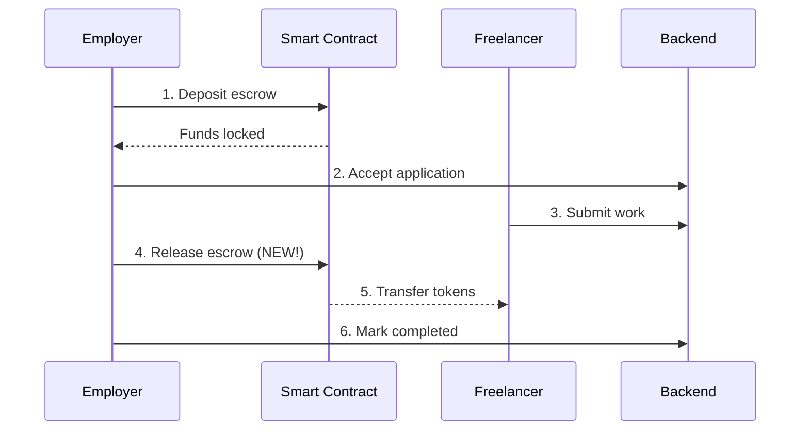

# ✅ ĐÃ SỬA: Token không chuyển đến freelancer khi approve

## 🐛 Vấn đề

**Trước:**
1. ✅ Escrow deposit thành công
2. ✅ Backend accept application
3. ❌ **Token KHÔNG được release** đến freelancer khi employer approve

**Nguyên nhân:** Thiếu bước **release escrow** từ smart contract sau khi employer approve work.

## ✅ Giải pháp

Đã thêm logic **release escrow tự động** vào hàm `handleApprove` trong `ApplicationList.tsx`.

### Flow mới (hoàn chỉnh):



### Code changes

#### 1. ApplicationList.tsx - Added escrow hooks

```typescript
// Import hooks
import { useEscrow } from "@/hooks/useEscrow";
import { useWallet } from "@/hooks/useWallet";

// Setup hooks
const { isConnected } = useWallet();
const { releaseAfterDeadline, getTaskIdFromExternal } = useEscrow({
  onSuccess: (tx) => {
    toast.success(`Payment released! Tx: ${tx.txHash.slice(0, 10)}...`);
  }
});
```

#### 2. handleApprove - Release escrow BEFORE backend update

```typescript
const handleApprove = async (id: string) => {
  // ... validation ...

  try {
    // Step 1: Get on-chain task ID
    const onChainTaskId = await getTaskIdFromExternal(taskExternalId);
    
    // Step 2: Release escrow to freelancer 🎉
    await releaseAfterDeadline(
      onChainTaskId,
      freelancerProfileId, // Freelancer's Lens address
      `Work approved for application ${id}`
    );

    // Step 3: Update backend AFTER successful release
    await apiClient.updateApplication(id, { status: "completed" });
    await apiClient.updateTask(taskId, { status: "completed" });
    
    // Step 4: Award points
    await apiClient.completeTaskAndUpdateUser(...);
    
    toast.success("Work approved and payment released!");
  } catch (error) {
    toast.error("Failed to approve and release payment");
  }
};
```

## 🎯 Kết quả

**Sau:**
1. ✅ Escrow deposit thành công
2. ✅ Backend accept application
3. ✅ Freelancer submits work
4. ✅ Employer clicks "Approve"
5. ✅ **Smart contract releases tokens** đến Lens address của freelancer 🎉
6. ✅ Backend updates status to "completed"

## 🧪 Cách test

### Test flow hoàn chỉnh:

1. **Employer deposits escrow:**
   - Mở task detail
   - Click "Accept" application
   - EscrowDeposit modal hiện
   - Deposit thành công → Funds locked in contract

2. **Freelancer submits work:**
   - Login as freelancer
   - Go to task
   - Click "Submit Outcome"
   - Enter work details

3. **Employer approves and releases payment:**
   - Login as employer
   - Go to task
   - Click "Approve" on submitted work
   - **Wallet sẽ yêu cầu confirm transaction release escrow**
   - Confirm → Tokens transfer to freelancer's Lens address! 🎉

4. **Verify payment:**
   - Check freelancer's wallet balance → Should increase
   - Check escrow contract → Status should be "settled"

## 📊 Smart Contract Flow

### TaskEscrow contract states:

```solidity
struct Escrow {
  address employer;
  address freelancer;
  uint256 amount;
  uint256 deadline;
  bool settled;      // ← Changes to true after release
  string externalTaskId;
}
```

### Release function:

```solidity
function releaseAfterDeadline(
  uint256 taskId,
  address to,
  string calldata reason
) external {
  Escrow storage e = escrows[taskId];
  require(!e.settled, "Already settled");
  require(block.timestamp >= e.deadline, "Deadline not reached");
  
  e.settled = true;
  token.transfer(to, e.amount); // ← Transfer tokens!
  
  emit Released(taskId, to, e.amount, reason);
}
```

## ⚠️ Important Notes

### 1. Wallet connection required

Employer MUST connect wallet to approve work vì cần sign transaction để release escrow.

```typescript
if (!isConnected) {
  toast.error("Please connect wallet to release payment");
  return;
}
```

### 2. Gas fees

Employer trả gas fee cho transaction release escrow (~0.001 - 0.01 tokens).

### 3. Deadline handling

Hiện tại dùng `releaseAfterDeadline()` - có thể cần check deadline:
- Nếu < deadline: Có thể cần implement `release()` function khác
- Nếu > deadline: `releaseAfterDeadline()` hoạt động OK

### 4. Error handling

Nếu release fail:
- Backend KHÔNG update status
- Employer có thể retry
- Viem sẽ show error message rõ ràng

## 🔜 Potential Improvements

### 1. Show escrow status in UI

```typescript
// Add to ApplicationCard
const escrowInfo = await readEscrow(onChainTaskId);
if (escrowInfo.settled) {
  // Show "Payment Released" badge
}
```

### 2. Auto-release option

```typescript
// Backend có thể implement auto-release sau X ngày nếu employer không approve
```

### 3. Dispute mechanism

```typescript
// Nếu employer không approve và không reject
// → Freelancer có thể claim sau deadline
```

## 🎉 Migration Complete!

Flow hoàn chỉnh giờ đã bao gồm:
- ✅ Deposit escrow
- ✅ Accept application
- ✅ Submit work
- ✅ **Release payment to freelancer** ← NEW!
- ✅ Update backend
- ✅ Award points

**Test ngay và xác nhận token đã chuyển đến freelancer!** 🚀
